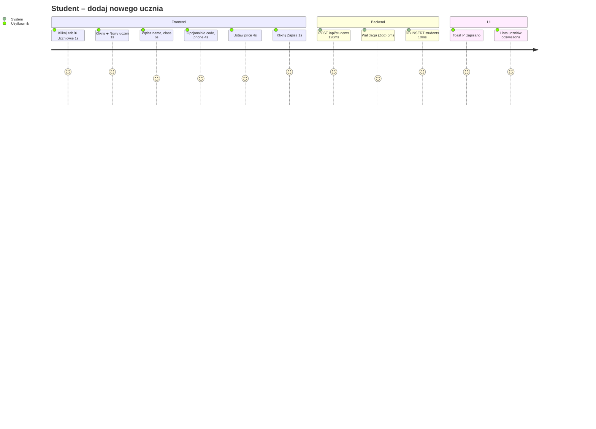
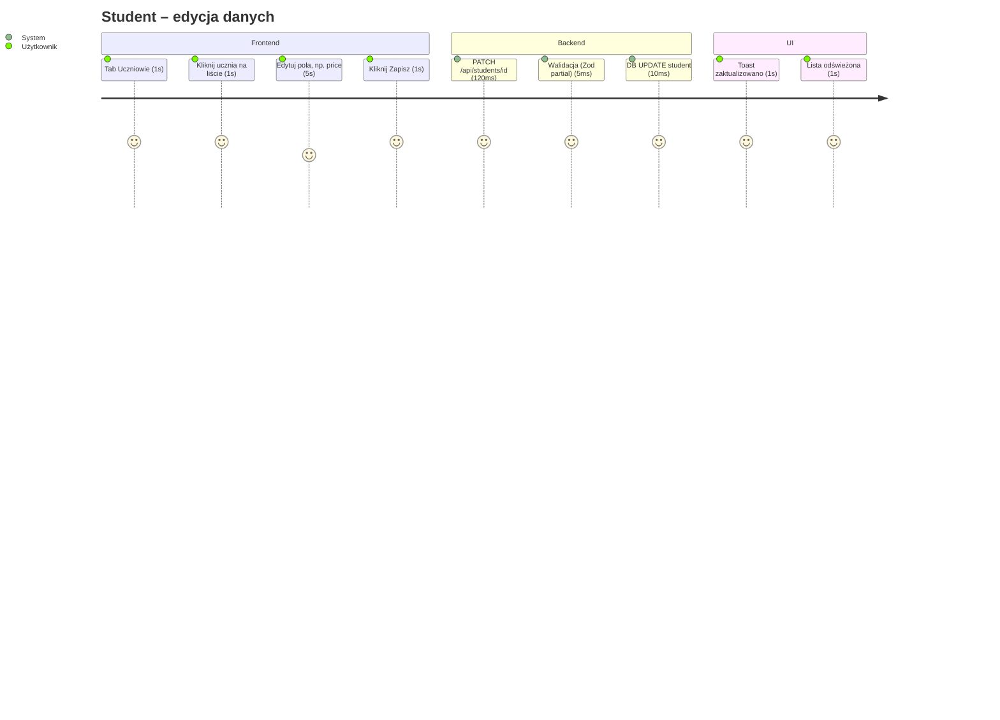
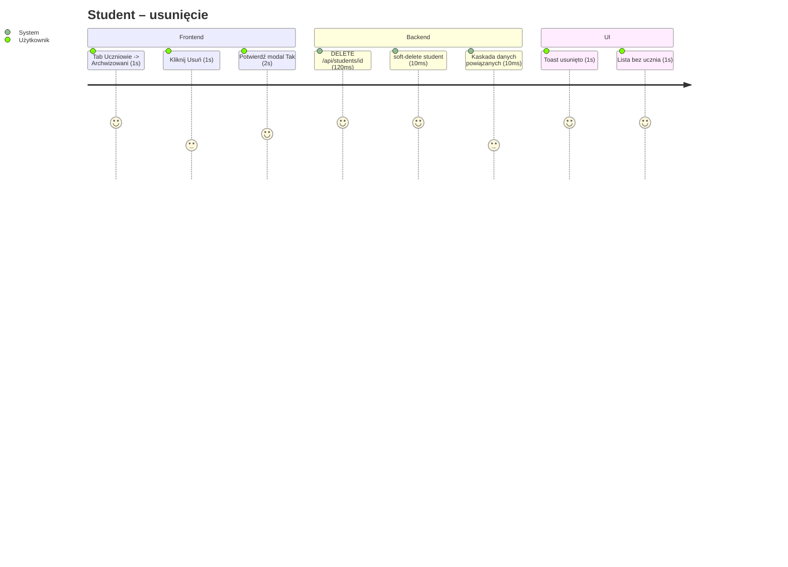
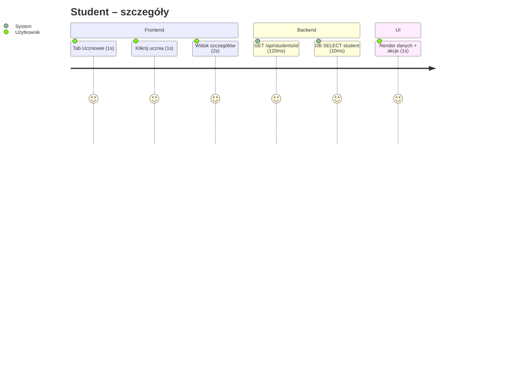
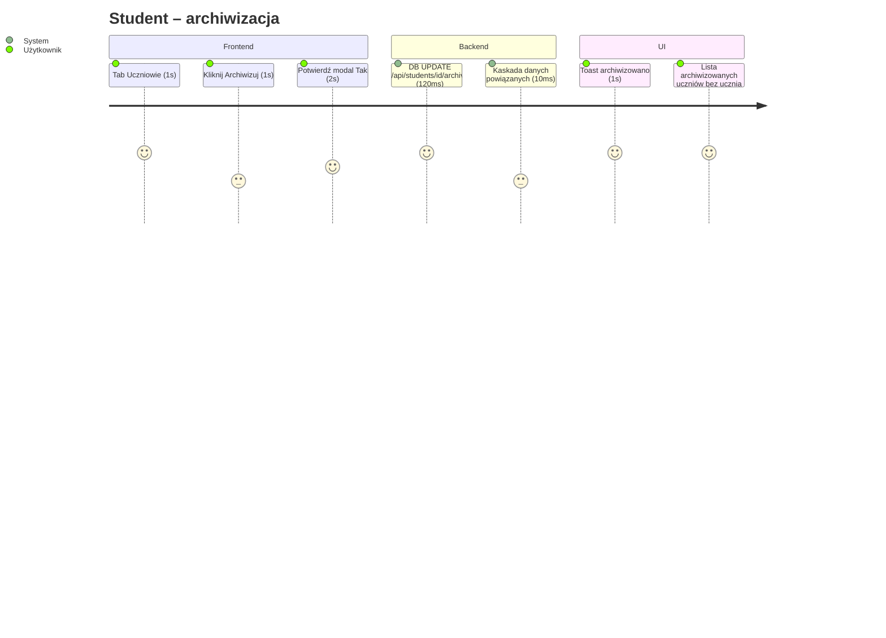

# User Flows – Session Logger

## Minimalny zestaw (MVP)
1) Dodanie ucznia
2) Dodanie sesji
3) Historia sesji ucznia

---

## 1. Dodanie ucznia
### Cel
Użytkownik dodaje ucznia, żeby logować do niego sesje.

✅ Success:
nowy uczeń pojawia się na liście
zwracane jest id

❌ Error: brak name / brak class / niepoprawny price → pokazujemy błąd walidacji

## 2. Edycja ucznia
### Cel
Użytkownik edytuje ucznia, żeby dane były aktualne

✅ Success:
zakualizowane dane ucznia pojawiają się na liście
zwracane jest id
❌ Error:
id nie istnieje → 404 → UI: „Uczeń nie znaleziony”

## 3. Usunięcie ucznia
### Cel
Użytkownik usuwa ucznia, aby zakończyć na stałe wspópracę z uczniem

✅ Success:
usunięty uczeń nie pojawia się na liście aktywnych i archiwizowanych uczniów
nic nie jest zwracane
❌ Error:
id nie istnieje → 404 → UI: „Uczeń nie znaleziony”

## 4. Szczegóły ucznia
### Cel
Użytkownik pobiera informacje o uczniu, aby mieć podgląd na daną osobę

✅ Success:
wyświetla się podgląd ucznia
zwracane są wszystkie dane
❌ Error:
id nie istnieje → 404 → UI: „Uczeń nie znaleziony”

## 6. Archiwizacja ucznia
### Cel
Użytkownik archiwizuje ucznia, aby określic zawieszoną wspópracę

✅ Success:
archiwizowany uczeń nie pojawia się na liście aktywych uczniów
zwracane jest id
❌ Error:
id nie istnieje → 404 → UI: „Uczeń nie znaleziony”

